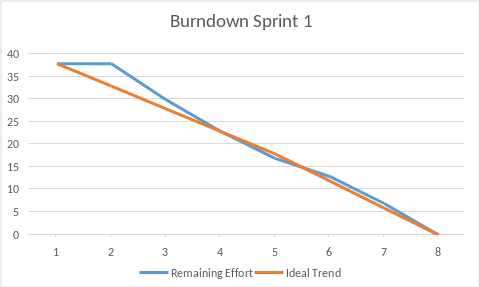

# 📱 Bot Procon Jacareí – WhatsApp

Chat bot em **TypeScript** para atendimento do **Procon de Jacareí/SP** via **WhatsApp**, usando API **gratuita** (whatsapp-web.js). Oferece orientação ao consumidor, **agendamento com horários livres**, histórico para o atendente e **métricas** (protocolo → vira dado → vira processo → gestão pública).

## Objetivo

- Orientação ao consumidor e informações sobre reclamações, contato e direitos básicos (CDC).
- **Agendamento** com consentimento (LGPD), opção de ver **horários livres** ou informar data preferida.
- **Painel do atendente**: histórico, métricas e marcação de protocolos (virou processo, gestão pública).
- Integração opcional com **Outlook** (Microsoft Graph) para criar eventos no calendário.

## Pré-requisitos

- **Node.js** 18 ou superior
- **npm** (ou yarn/pnpm)
- Conta WhatsApp (recomendado: número institucional do Procon)

**Número usado no projeto:** (12) 99207-4513 — para contato exibido ao consumidor (opção 3) e, se desejar, como `ADMIN_NUMBER` no `.env`.

## Instalação

```bash
cd ABP6
npm install
npm run build
```

## Como rodar

**Desenvolvimento (reload automático):**

```bash
npm run dev
```

**Produção:**

```bash
npm run build
npm start
```

**Primeira conexão:** o terminal exibe um **QR Code**. No WhatsApp (celular): **Aparelhos conectados** → **Conectar um aparelho** → escanear o QR. A sessão fica em `.wwebjs_auth`.

**Erro "Execution context was destroyed" ao iniciar:** (1) O bot tenta de novo sozinho após 4 segundos. (2) No `.env` adicione `HEADLESS=false`, rode `npm run dev` e escaneie o QR na janela do Chrome que abrir — muitas vezes resolve sem apagar nada.

## Menu do bot (opções)

| Opção | Conteúdo                                                                                     |
| ----- | -------------------------------------------------------------------------------------------- |
| **1** | Orientações ao consumidor                                                                    |
| **2** | Como registrar reclamação                                                                    |
| **3** | Contato e endereço Procon Jacareí                                                            |
| **4** | Horário de atendimento                                                                       |
| **5** | Direitos básicos do consumidor (CDC)                                                         |
| **6** | **Agendamento** (solicitar ou tirar dúvidas; fluxo com consentimento LGPD e horários livres) |

O usuário pode digitar **oi**, **menu** ou **início** para ver o menu a qualquer momento.

## Agendamento (opção 6)

1. **Consentimento (LGPD)** – texto informando coleta de dados (nome, WhatsApp, motivo, data); o usuário digita _SIM_ ou _NÃO_.
2. **Nome** → **Motivo** → **Data:**
   - _1_ = ver **horários livres** (lista de slots disponíveis); o usuário escolhe pelo número.
   - _2_ = informar data preferida (ex.: 15/03/2025 ou "o mais cedo possível").
3. **Confirmação** – o usuário digita _confirmar_ ou _cancelar_.

Os agendamentos são salvos em `data/agendamentos.json`. Se o Outlook estiver configurado, um evento é criado no calendário. Ver [documentacao/AGENDA-LIVRE-OCUPADA.md](documentacao/AGENDA-LIVRE-OCUPADA.md).

## Painel do atendente

Quem estiver com o número configurado em `ADMIN_NUMBER` pode:

- Enviar **atendente**, **historico** ou **metricas** → recebe o painel com:
  - **Ciclo do protocolo:** Vira dado, Vira processo, Gestão pública.
  - Métricas (total, hoje, últimos 7 dias, por status).
  - Lista dos últimos agendamentos (com ID).
- Marcar protocolo como **virou processo:** `processo ag-1234567890-abc123`
- Marcar protocolo como **gestão pública:** `gestao ag-1234567890-abc123`

Ver [documentacao/METRICAS-PROTOCOLO.md](documentacao/METRICAS-PROTOCOLO.md).

## API utilizada (gratuita)

- **[whatsapp-web.js](https://github.com/pedroslopez/whatsapp-web.js)** – conexão via WhatsApp Web (multidevice), sem custo de API.

## Documentação

| Documento                                                      | Conteúdo                                                             |
| -------------------------------------------------------------- | -------------------------------------------------------------------- |
| [.github/BACKLOG.md](.github/BACKLOG.md)                       | Backlog do produto e tarefas em 3 sprints (uso com GitHub Projects). |
| [documentacao/ARQUITETURA.md](documentacao/ARQUITETURA.md)                 | Visão geral, stack, fluxo, agendamento, Outlook, LGPD, métricas.     |
| [documentacao/PASSO-A-PASSO.md](documentacao/PASSO-A-PASSO.md)             | Guia do zero até o bot funcionando.                                  |
| [documentacao/REQUISITOS-API-E-MAIS.md](documentacao/REQUISITOS-API-E-MAIS.md) | API, ambiente, segurança, Evolution API.                             |
| [documentacao/OUTLOOK-AGENDAMENTO.md](documentacao/OUTLOOK-AGENDAMENTO.md) | Integração gratuita com Outlook (Microsoft Graph).                   |
| [documentacao/AGENDA-LIVRE-OCUPADA.md](documentacao/AGENDA-LIVRE-OCUPADA.md) | Gerenciamento de horários livres x ocupados.                         |
| [documentacao/METRICAS-PROTOCOLO.md](documentacao/METRICAS-PROTOCOLO.md)  | Métricas: vira dado, vira processo, gestão pública.                  |

## Estrutura do projeto

```
src/
├── index.ts
├── bot/ProconBot.ts
├── handlers/MessageHandler.ts
├── services/
│   ├── MenuService.ts
│   ├── AgendamentoService.ts
│   ├── AgendamentoStore.ts
│   └── OutlookCalendarService.ts
└── types/agendamento.ts
```

Dados persistidos em `data/agendamentos.json` (pasta `data/` no `.gitignore`).

## Configuração de textos (Procon)

Contato, endereço e horário: edite `src/services/MenuService.ts` (métodos `getContato()` e `getHorario()`).
## Burndonw's 📉:

<p align="center"></p>

## Apresentações 🎥:

<a href="https://www.youtube.com/watch?v=91aUjvrli_g">Apresentação Sprint 1</a>

## Licença

MIT.
