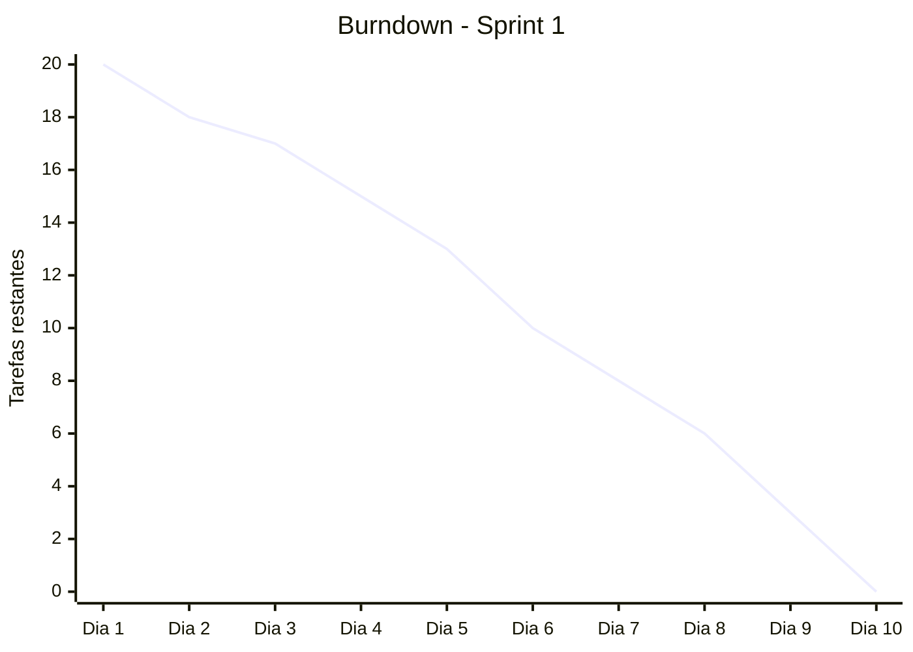

# 📱 Bot Procon Jacareí – WhatsApp

Chat bot em **TypeScript** para atendimento do **Procon de Jacareí/SP** via **WhatsApp**, usando API **gratuita** (whatsapp-web.js). Oferece orientação ao consumidor, **agendamento com horários livres**, histórico para o atendente e **métricas** (protocolo → vira dado → vira processo → gestão pública).

## Objetivo

- Orientação ao consumidor e informações sobre reclamações, contato e direitos básicos (CDC).
- **Agendamento** com consentimento (LGPD), opção de ver **horários livres** ou informar data preferida.
- **Painel do atendente**: histórico, métricas e marcação de protocolos (virou processo, gestão pública).
- Integração opcional com **Outlook** (Microsoft Graph) para criar eventos no calendário.

## Pré-requisitos

- **Node.js** 18 ou superior
- **npm** (ou yarn/pnpm)
- Conta WhatsApp (recomendado: número institucional do Procon)

**Número usado no projeto:** (12) 99207-4513 — para contato exibido ao consumidor (opção 3) e, se desejar, como `ADMIN_NUMBER` no `.env`.

## Menu do bot (opções)

| Opção | Conteúdo                                                                                     |
| ----- | -------------------------------------------------------------------------------------------- |
| **1** | Orientações ao consumidor                                                                    |
| **2** | Como registrar reclamação                                                                    |
| **3** | Contato e endereço Procon Jacareí                                                            |
| **4** | Horário de atendimento                                                                       |
| **5** | Direitos básicos do consumidor (CDC)                                                         |
| **6** | **Agendamento** (solicitar ou tirar dúvidas; fluxo com consentimento LGPD e horários livres) |

O usuário pode digitar **oi**, **menu** ou **início** para ver o menu a qualquer momento.

## Agendamento (opção 6)

1. **Consentimento (LGPD)** – texto informando coleta de dados (nome, WhatsApp, motivo, data); o usuário digita _SIM_ ou _NÃO_.
2. **Nome** → **Motivo** → **Data:**
   - _1_ = ver **horários livres** (lista de slots disponíveis); o usuário escolhe pelo número.
   - _2_ = informar data preferida (ex.: 15/03/2025 ou "o mais cedo possível").
3. **Confirmação** – o usuário digita _confirmar_ ou _cancelar_.

Os agendamentos são salvos em `data/agendamentos.json`. Se o Outlook estiver configurado, um evento é criado no calendário. Ver [documentacao/AGENDA-LIVRE-OCUPADA.md](documentacao/AGENDA-LIVRE-OCUPADA.md).


## API utilizada (gratuita)

- **[whatsapp-web.js](https://github.com/pedroslopez/whatsapp-web.js)** – conexão via WhatsApp Web (multidevice), sem custo de API.

## Estrutura do projeto

```
src/
├── index.ts
├── bot/ProconBot.ts
├── handlers/MessageHandler.ts
├── services/
│   ├── MenuService.ts
│   ├── AgendamentoService.ts
│   ├── AgendamentoStore.ts
│   └── OutlookCalendarService.ts
└── types/agendamento.ts
```


## Instalação

```bash
cd ABP6
npm install
npm run build
```

## Como rodar

**Desenvolvimento (reload automático):**

```bash
npm run dev
```

**Produção:**

```bash
npm run build
npm start
```

Dados persistidos em `data/agendamentos.json` e `data/agenda-atendentes.json` (pasta `data/` no `.gitignore`).

## Configuração de textos (Procon)

Contato, endereço e horário: edite `src/services/MenuService.ts` (métodos `getContato()` e `getHorario()`).
## Burndown das Sprints 📉


```mermaid
xychart-beta
  title "Burndown - Sprint 1"
  x-axis ["Dia 1", "Dia 2", "Dia 3", "Dia 4", "Dia 5", "Dia 6", "Dia 7", "Dia 8", "Dia 9", "Dia 10"]
  y-axis "Tarefas restantes" 0 --> 20
  line [20, 18, 17, 15, 13, 10, 8, 6, 3, 0]
```

## 🏁 Sprint Review e Retrospective

## Sprint 1

### 1. Sprint Review

| Categoria | Detalhes |
| :--- | :--- |
| **Objetivo da Sprint 1** | Fundação técnica do projeto, conexão com a API do WhatsApp e implementação do menu inicial de autoatendimento. |
| **Funcionalidades entregues** | • Configuração do ambiente de desenvolvimento em Node.js com TypeScript.<br>• Integração da biblioteca `whatsapp-web.js` com exibição de QR Code.<br>• Implementação de persistência de sessão (LocalAuth) para evitar reconexões manuais.<br>• Criação do fluxo inicial de boas-vindas e resposta ao comando "menu".<br>• Documentação técnica inicial com instruções. |
| **Demonstração do incremento** | O bot foi inicializado sem erros, gerou o QR Code no terminal, o número de WhatsApp de teste e respondeu de forma autônoma às interações enviando o menu de opções. |
| **Feedback (Produto)** | O projeto atendeu aos requisitos básicos de conexão e execução. A documentação inicial demonstrou compreensão da arquitetura. |

---


## Sprint 2


### 1. Sprint Review 

| Categoria | Detalhes |
| :--- | :--- |
| **Objetivo da Sprint 2** | Conteúdo útil ao cidadão, fluxos claros e agendamento com LGPD e horários livres. |
| **Funcionalidades entregues** | • Fluxos de atendimento com orientações completas (CDC e contatos).<br>• Sistema de agendamento presencial com listagem de horários livres.<br>• Termo de consentimento e conformidade com a LGPD.<br>• Evoluções do painel interno (correções, testes automatizados e exportação).<br>• Estruturação de métricas administrativas. |
| **Demonstração do incremento** | O bot conduz o usuário por todo o fluxo de agendamento de forma autônoma, garantindo a coleta de aceite da LGPD, e integra esses dados ao painel interno para monitoramento e gestão. |
| **Feedback do Avaliador (Produto)** | O projeto apresenta uma proposta consistente. A preocupação com LGPD, métricas e integração futura com sistemas externos. Evolução funcional sólida. |

---


## Documentação das funcionalidades implementadas:

| Documento                                                      | Conteúdo                                                             |
| -------------------------------------------------------------- | -------------------------------------------------------------------- |
| [.github/BACKLOG.md](.github/BACKLOG.md)                       | Backlog do produto e tarefas em 3 sprints (uso com GitHub Projects). |
| [documentacao/ARQUITETURA.md](documentacao/ARQUITETURA.md)                 | Visão geral, stack, fluxo, agendamento, Outlook, LGPD, métricas.     |
| [documentacao/PASSO-A-PASSO.md](documentacao/PASSO-A-PASSO.md)             | Guia do zero até o bot funcionando.                                  |
| [documentacao/REQUISITOS-API-E-MAIS.md](documentacao/REQUISITOS-API-E-MAIS.md) | API, ambiente, segurança, Evolution API.                             |
| [documentacao/OUTLOOK-AGENDAMENTO.md](documentacao/OUTLOOK-AGENDAMENTO.md) | Integração gratuita com Outlook (Microsoft Graph).                   |
| [documentacao/AGENDA-LIVRE-OCUPADA.md](documentacao/AGENDA-LIVRE-OCUPADA.md) | Gerenciamento de horários livres x ocupados.                         |
| [documentacao/SPRINT-2-PAINEL-INTERNO.md](documentacao/SPRINT-2-PAINEL-INTERNO.md) | Tarefas Sprint 2 – evolução do painel interno.                         |
| [documentacao/METRICAS-PROTOCOLO.md](documentacao/METRICAS-PROTOCOLO.md)  | Métricas: vira dado, vira processo, gestão pública.                  |
| [documentacao/AZURE-CONFIGURACAO.md](documentacao/AZURE-CONFIGURACAO.md) | Onde guardar guias Azure (fora do Git); pasta `local/`. |
| [documentacao/DEPLOY-AZURE-ETAPAS.md](documentacao/DEPLOY-AZURE-ETAPAS.md) | Referência histórica do deploy Azure em App Service. |
| [documentacao/DEPLOY-VM-DOCKER.md](documentacao/DEPLOY-VM-DOCKER.md) | Guia atual de deploy em Azure VM com Docker (bot + painel). |
| [documentacao/VM-SCHEDULE-GITHUB.md](documentacao/VM-SCHEDULE-GITHUB.md) | Agendamento da VM (17h–23h): start/deallocate via GitHub Actions. |
| [infra/azure/README.md](infra/azure/README.md) | Índice dos scripts/workflows Azure (backend e painel em App Service). |
| [Apresentação Sprint 1 (YouTube)](https://www.youtube.com/watch?v=91aUjvrli_g) | Vídeo da apresentação / demo da Sprint 1.                           |

## 👩‍💻 Equipe
<table>
  <thead>
    <tr>
      <th>Função</th>
      <th>Integrante</th>
    </tr>
  </thead>
  <tbody>
    <tr>
      <td>Product Owner</td>
      <td>
        <a href="https://github.com/FPBueno">
          
        </a>
      </td>
    </tr>
    <tr>
      <td>Dev Team</td>
      <td>
        <a href="https://github.com/Marcelly-cris">
          
        </a>
      </td>
    </tr>
    <tr>
      <td>Dev Team</td>
      <td>
        <a href="https://github.com/MingRenan">
          
        </a>
      </td>
    </tr>
    <tr>
      <td>Scrum Master</td>
      <td>
        <a href="https://github.com/Isaac-Souza-Santos">
          
        </a>
      </td>
    </tr>
    <tr>
      <td>Dev team</td>
      <td>
        <a href="https://github.com/AnaBarbancho">
          
        </a>
      </td>
    </tr>
  </tbody>
</table>

## Apresentações

**Sprint**  | **Inicio / Fim** | **Status**         | **Link**
:---------: | :------:    | :-------:          | :-------:
01          | 26/03 - 13/04   | ✅                | <a href="https://www.youtube.com/watch?v=91aUjvrli_g">Sprint 1</a>
02          | 14/04 - 18/05   | ✅                | <a href="https://www.youtube.com/watch?v=t9qXJUcBCzI">Sprint 2</a>
03          | 19/05 - 15/06   | ⚠️               | <a href="#">Sprint 3</a>


## Licença

MIT.
