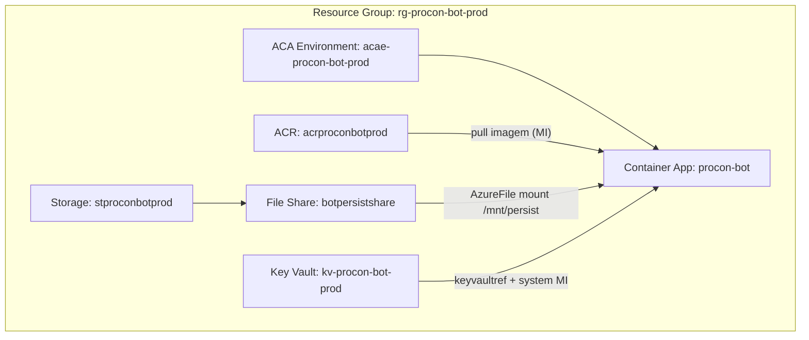

# Arquitetura Azure — Procon Jacareí Bot (WhatsApp)

Documento de referência da solução implantada em **Azure Container Apps** com **persistência em Azure Files**, **imagem no ACR** e **segredos no Key Vault**. Os nomes abaixo seguem os valores por defeito em `infra/azure/deploy-containerapp.ps1` (ajustáveis por parâmetros). A **lista completa item a item** com explicação está na **secção 2**. O que o projeto **ignora no Git e na imagem Docker** (`.gitignore` / `.dockerignore`) está na **secção 12**.

---

## 1. Visão geral

| Camada | Recurso (defeito) | Função |
|--------|-------------------|--------|
| Compute | **Container App** `procon-bot` | Corre a imagem Docker (Node + Chromium + `whatsapp-web.js`) |
| Ambiente | **Container Apps Environment** `acae-procon-bot-prod` | Rede gerida, integração com storage registado |
| Imagem | **ACR** `acrproconbotprod` | `procon-bot:<tag>`; deploy pinnado por **digest** `@sha256:…` para forçar pull |
| Persistência | **Storage Account** + **File Share** `botpersistshare` | Montado em `/mnt/persist` no contentor |
| Segredos | **Key Vault** `kv-procon-bot-prod` | `GROQ-API-KEY`, `ADMIN-NUMBER` referenciados pelo ACA |
| Grupo | **Resource Group** `rg-procon-bot-prod` | Agrupa recursos |

**Escala:** `minReplicas` / `maxReplicas` = **1** (uma réplica) para evitar dois processos Chromium no mesmo perfil/partilha.

**Ingress:** **internal**, `targetPort` **3000** (health HTTP no app).

---

## 2. Catálogo: cada item criado e explicação

Lista objetiva do que existe na **assinatura Azure** (ou no **repositório**) após seguir `provision-foundation.ps1`, segredos no Key Vault, `deploy-containerapp.ps1` e operação normal. Nomes por defeito; parâmetros nos scripts podem alterá-los.

### 2.1 Registo de providers (assinatura)

| Item | O quê | Explicação |
|------|--------|------------|
| **Resource providers** | `Microsoft.ContainerRegistry`, `Microsoft.KeyVault`, `Microsoft.Storage`, `Microsoft.App`, `Microsoft.OperationalInsights` | `provision-foundation.ps1` regista-os com `az provider register --wait` para a subscrição aceitar criação de ACR, Key Vault, Storage, Container Apps e Log Analytics. |

### 2.2 Grupo de recursos

| Item | Nome (defeito) | Explicação |
|------|----------------|------------|
| **Resource group** | `rg-procon-bot-prod` | Contentor lógico de todos os recursos do ambiente de produção do bot; facilita permissões, custos e eliminação controlada. |

### 2.3 Registo de contentores (imagem)

| Item | Nome (defeito) | Explicação |
|------|----------------|------------|
| **Azure Container Registry** | `acrproconbotprod` | Armazena a imagem Docker `procon-bot` (tags como `v1` / `latest`). SKU Basic no script de fundação; admin desativado — o Container App puxa com **Managed Identity** (`AcrPull`). |

### 2.4 Armazenamento e partilha de ficheiros

| Item | Nome (defeito) | Explicação |
|------|----------------|------------|
| **Storage account** | `stproconbotprod` | Conta StorageV2 LRS que suporta **Azure Files** (SMB) para dados que sobrevivem a restarts do contentor. |
| **File share** | `botpersistshare` (quota 50 GB no script) | Partilha montada no Container App em `/mnt/persist`: sessão LocalAuth (exceto `session/` ativo), `data/`, pasta `_seed_session` para cópia inicial do perfil Chromium. |

### 2.5 Cofre de segredos

| Item | Nome (defeito) | Explicação |
|------|----------------|------------|
| **Key Vault** | `kv-procon-bot-prod` | Guarda segredos (API Groq, número admin, outros opcionais). O Container App lê via **referência** `keyvaultref` + MI, sem colocar valores em texto no ARM. |
| **RBAC no Key Vault** | Atribuição ao **utilizador** que corre o script | `Key Vault Secrets Officer` no scope do cofre para permitir `az keyvault secret set` durante a configuração manual. |

### 2.6 Ambiente Container Apps e monitorização

| Item | Nome (defeito) | Explicação |
|------|----------------|------------|
| **Container Apps Environment** | `acae-procon-bot-prod` | Rede e runtime partilhados onde o `procon-bot` corre; aqui se **regista** o Azure Files (`env storage set`) para depois montar no app. |
| **Log Analytics** | Gerado automaticamente com o environment | Workspace associado ao environment para métricas e logs do ACA (diagnóstico operacional). |

### 2.7 Aplicação em contentores

| Item | Nome (defeito) | Explicação |
|------|----------------|------------|
| **Container App** | `procon-bot` | Unidade de execução: uma réplica (min/max = 1) com CPU 0.5 e memória 1 Gi no script de deploy; corre Node + Chromium + bot WhatsApp. |
| **Ingress** | `internal`, porta **3000** | Tráfego só dentro da rede do environment (não público na Internet por defeito); alinha com `HEALTH_PORT=3000` e endpoints `/livez` / `/readyz`. |
| **Managed identity (system)** | Ligada ao `procon-bot` | Identidade do serviço para **AcrPull** e **Key Vault Secrets User** sem credenciais em código. |
| **Secrets do app (ACA)** | `groq-api-key`, `admin-number` | Nomes internos do Container App que mapeiam `secretref:` para variáveis `GROQ_API_KEY` e `ADMIN_NUMBER`; valores vêm do Key Vault. |
| **Imagem referenciada** | `…/procon-bot@sha256:…` ou `:tag` | Deploy resolve **digest** da tag no ACR para forçar pull de nova camada quando a tag não muda (ex.: sempre `v1`). |

### 2.8 Ligação do share ao environment

| Item | O quê | Explicação |
|------|--------|------------|
| **Storage no Container Apps Environment** | Nome de storage `botpersistshare` (igual ao share no script) | `az containerapp env storage set` associa conta, chave e share ao environment; sem isto o volume `AzureFile` no template não encontra o backend. |

### 2.9 Volumes no template do contentor (ARM)

| Item | Nome técnico | Explicação |
|------|--------------|------------|
| **Volume Azure Files** | `persist-vol` | Montagem SMB em `/mnt/persist` — persistência entre revisões. |
| **Volume EmptyDir** | `chrome-session-empty` | Montado em `AUTH_PATH/session` — disco **local** da réplica para locks e I/O do Chromium; evita *browser is already running* no SMB. |
| **Script `apply-persist-volume.mjs`** | — | Gera payload ARM mínimo (API `2024-03-01`) e **PUT** porque a CLI não expõe bem Azure Files + EmptyDir em conjunto. |

### 2.10 Variáveis de ambiente relevantes (criadas/atualizadas no deploy)

| Variável | Explicação |
|----------|------------|
| `NODE_ENV=production` | Modo produção Node. |
| `HEALTH_PORT=3000` | Porta do servidor HTTP de health. |
| `AUTH_PATH` | Raiz LocalAuth; com partilha: `/mnt/persist/.wwebjs_auth`. |
| `DATA_DIR` | Agendamentos e ficheiros em `data/`; com partilha: `/mnt/persist/data`. |
| `GROQ_API_KEY` / `ADMIN_NUMBER` | Via `secretref` a partir dos secrets do ACA. |
| `CHROME_SESSION_EMPTYDIR=1` | Quando há persistência em `/mnt/persist` — indica nos logs que `session/` está em EmptyDir. |

### 2.11 Atribuições de roles (RBAC na subscrição / recursos)

| Item | O quê | Explicação |
|------|--------|------------|
| **AcrPull** | Principal = MI do `procon-bot`, scope = ACR | Permite `docker pull` da imagem sem password de admin do registo. |
| **Key Vault Secrets User** | Principal = MI do `procon-bot`, scope = Key Vault | Permite ler segredos referenciados em tempo de execução. |

### 2.12 Revisões do Container App

| Item | O quê | Explicação |
|------|--------|------------|
| **Nova revisão** | Cada `create`/`update` + ARM PUT de volumes | Imagem/env/template alterados geram revisão; o script espera e **desativa revisões antigas** ativas para não haver dois contentores a usar o mesmo userDataDir no share. |

### 2.13 Segredos no Key Vault (criados por ti, não pelo script de fundação)

| Segredo (nome) | Explicação |
|----------------|------------|
| `GROQ-API-KEY` | Chave da API **Groq** (tier gratuito do projeto). |
| `ADMIN-NUMBER` | WhatsApp do atendente (formato internacional, ex. `5512…`). |
| Outros (opcional) | Firebase, Outlook/Graph, etc., se o bot usar — cada um precisa de entrada no Key Vault e mapeamento no deploy se forem injetados no ACA. |

### 2.14 Pastas e ficheiros no file share (criados em runtime ou por upload)

| Item | Explicação |
|------|------------|
| `.wwebjs_auth/` (no share) | Credenciais LocalAuth e ficheiros fora de `session/` persistentes. |
| `.wwebjs_auth/_seed_session/` | Cópia de referência da pasta `session/` enviada do PC (`upload-session-to-fileshare.ps1`); o entrypoint copia para o EmptyDir `session/` quando vazio ou após bump. |
| `.wwebjs_auth/_seed_session/.seed-bump` | Marcador de versão do seed; mudança força recópia após restart (EmptyDir não se apaga sozinho). |
| `data/` | `agendamentos.json` e restantes dados de aplicação no share. |

### 2.15 Repositório — workflow CI/CD

| Item | Caminho | Explicação |
|------|---------|------------|
| **GitHub Actions** | `.github/workflows/acr-build-push.yml` | Build/push da imagem para o ACR e deploy (via `gha-deploy-containerapp.sh`) em push ou `workflow_dispatch`; requer segredo `AZURE_CREDENTIALS`. |

### 2.16 Repositório — scripts e ficheiros de infra (entregáveis)

| Ficheiro | Explicação |
|----------|------------|
| `infra/azure/provision-foundation.ps1` | Cria RG (se faltar), ACR, storage + share, Key Vault, environment ACA e regista providers. |
| `infra/azure/deploy-containerapp.ps1` | Build opcional no ACR, `env storage set`, create/update Container App, digest, `apply-persist-volume.mjs`, roles MI, desativa revisões antigas. |
| `infra/azure/apply-persist-volume.mjs` | ARM PUT: volumes AzureFile + EmptyDir e alinhamento de `AUTH_PATH` / `DATA_DIR` no template. |
| `infra/azure/build-push-local.ps1` | Build Docker na máquina e push para o ACR (quando `az acr build` não é permitido). |
| `infra/azure/gha-deploy-containerapp.sh` | Mesma linha de deploy que o PowerShell, para Linux/GitHub Actions. |
| `infra/azure/upload-session-to-fileshare.ps1` | Envia sessão local para o share (`.wwebjs_auth` + `_seed_session` + `.seed-bump`). |
| `infra/azure/bootstrap-auth.ps1` | `az containerapp logs show --follow` para ver QR e estado de autenticação. |
| `infra/azure/flush-persist-and-acr.ps1` | Limpeza agressiva (ACR/share); uso com cautela. |
| `infra/azure/clear-chromium-session-on-share.ps1` | Remove `session` no share / wipe opcional; listado no `.gitignore` — ver **12.1**. |
| `docker-entrypoint.sh` | Seed para EmptyDir, limpeza de locks Singleton antes do `node`. |
| `Dockerfile` | Imagem base com Chromium e entrypoint. |

---

## 3. Diagrama lógico

---

## 4. Contentor: volumes e caminhos

No template aplicado por `infra/azure/apply-persist-volume.mjs` (ARM `2024-03-01`), o contentor tem **dois** volumes:

### 4.1 Azure Files — `persist-vol`

- **Tipo:** `AzureFile` (share `botpersistshare` registado no environment como storage `botpersistshare`).
- **Mount:** `/mnt/persist`
- **Uso no app:**
  - `AUTH_PATH=/mnt/persist/.wwebjs_auth` — dados **LocalAuth** fora do perfil Chromium efémero (ficheiros na raiz desta pasta no share).
  - `DATA_DIR=/mnt/persist/data` — **dados de runtime** (ex.: agendamentos, métricas Groq): **persistem** entre revisões e restarts.

### 4.2 EmptyDir — `chrome-session-empty`

- **Tipo:** `EmptyDir` (disco **efémero** da réplica).
- **Mount:** `/mnt/persist/.wwebjs_auth/session` (caminho mais específico que “sobrepõe” só a subpasta `session` sobre o mount SMB).
- **Motivo:** Chromium + **Azure Files (SMB)** geravam erros tipo *browser is already running* / locks inconsistentes. O perfil ativo do Chrome fica em disco local da réplica.
- **Variável:** `CHROME_SESSION_EMPTYDIR=1` (definida pelo deploy com volume em `/mnt/persist`) — o `ProconBot` regista nos logs que o modo EmptyDir está ativo.

**Nota:** Symlink de `session` → `/tmp` no share **não é suportado** pelo SMB (`Operation not supported`); por isso a solução é EmptyDir, não symlink no entrypoint.

---

## 5. Sessão WhatsApp: seed no share + entrypoint

Fluxo para reutilizar perfil Chromium vindo do PC (`security\.wwebjs_auth` ou `.wwebjs_auth` local):

1. **`infra/azure/upload-session-to-fileshare.ps1`** envia:
   - ficheiros em `.wwebjs_auth` **exceto** a pasta `session/` → para o share em `.wwebjs_auth/…`;
   - conteúdo de **`session/`** → **`.wwebjs_auth/_seed_session/`** no share;
   - ficheiro **`.wwebjs_auth/_seed_session/.seed-bump`** (valor novo a cada upload).

2. **`docker-entrypoint.sh`** (antes do `node`):
   - se `_seed_session` tem conteúdo e **`session/` (EmptyDir) está vazio** **ou** o **`.seed-bump` do share ≠ do EmptyDir`**, apaga o conteúdo de `session/` e faz **`cp -a`** de `_seed_session` → `session/`;
   - remove locks órfãos (`SingletonLock`, etc.) antes de arrancar.

**Porquê o `.seed-bump`:** um `revision restart` mantém o EmptyDir; se `session/` já tiver ficheiros, sem bump o seed não seria reaplicado. Após **cada novo upload**, o bump muda e o próximo arranque **força** nova cópia.

**Limitação:** perfil copiado de **Windows** para **Linux** pode não ser aceite pelo WhatsApp; nesse caso é necessário **QR no Azure** uma vez.

---

## 6. Segredos e identidade

- **Managed identity (system)** no Container App:
  - **AcrPull** no registo `acrproconbotprod`;
  - **Key Vault Secrets User** no `kv-procon-bot-prod`.
- **Secrets** no ACA (mapeados para env):
  - `GROQ_API_KEY` ← Key Vault secret `GROQ-API-KEY`;
  - `ADMIN_NUMBER` ← Key Vault secret `ADMIN-NUMBER`.

O código usa **Groq** em modo compatível com tier gratuito (ver regras do projeto).

---

## 7. Pipeline de deploy (resumo)

1. **Build** TypeScript local: `npm run build` (manual, conforme regras do repo).
2. **Imagem:** `infra/azure/build-push-local.ps1` (Docker → ACR) ou `az acr build` / GitHub Actions (`acr-build-push.yml`).
3. **Deploy:** `infra/azure/deploy-containerapp.ps1` com `-MountAzureFilesShare` (e `-SkipBuild` se a imagem já existir):
   - `az containerapp env storage set` (registo do share no environment);
   - `az containerapp create/update` com env vars e secrets;
   - `node infra/azure/apply-persist-volume.mjs` + `az rest PUT` para volumes **AzureFile** + **EmptyDir** (CLI não expõe tudo).
4. **Digest:** o script resolve `sha256` da tag no ACR e usa `repo@digest` para o ACA **puxar** a revisão certa quando a tag se mantém (ex.: `v1`).

Após deploy, espera curta e **desativa revisões antigas** (script) para reduzir risco de dois contentores no mesmo share.

---

## 8. Scripts úteis (infra)

Tabela rápida; descrição por ficheiro na **secção 2.16**.

| Script | Função |
|--------|--------|
| `deploy-containerapp.ps1` | Deploy principal ACA + volume + digest |
| `gha-deploy-containerapp.sh` | Equivalente em bash (CI/Linux) |
| `build-push-local.ps1` | Build Docker local + push ACR |
| `upload-session-to-fileshare.ps1` | Sobe `.wwebjs_auth` + `_seed_session` + `.seed-bump` |
| `provision-foundation.ps1` | Fundações (RG, storage, etc., conforme script) |
| `flush-persist-and-acr.ps1` | Operações destrutivas de limpeza (cuidado) |

O ficheiro `clear-chromium-session-on-share.ps1` está **no `.gitignore`** — detalhe na **secção 12.1**.

---

## 9. Ficheiros de código relevantes

- `src/config/paths.ts` — `AUTH_PATH`, `DATA_DIR`, `security/.env` local.
- `src/bot/ProconBot.ts` — retries Chromium, limpeza de `session` em erros singleton (complementar ao EmptyDir).
- `docker-entrypoint.sh` — seed, locks.
- `Dockerfile` — Chromium em Debian slim, entrypoint.

---

## 10. Custos e observabilidade

- Custos dependem de região, horas a 1 réplica, tamanho do share, SKU do ACR, etc. Usar **Cost Management** no portal e o **Azure Pricing Calculator**.
- Logs: `az containerapp logs show -n procon-bot -g rg-procon-bot-prod --follow`.

---

## 11. Ambiente local vs Azure

| Aspeto | Local (`security/`) | Azure |
|--------|---------------------|--------|
| `.env` | `security/.env` (se pasta existir) | Variáveis + Key Vault no ACA |
| Sessão WA | `security/.wwebjs_auth` | `AUTH_PATH` no share + EmptyDir em `session/` + `_seed_session` |
| `data/` | `data/` na raiz do repo | `/mnt/persist/data` no share |

A pasta `security` **não** vai na imagem Docker (`.dockerignore`); o Azure **não** lê o teu `security/.env` automaticamente.

---

## 12. `.gitignore` e `.dockerignore` (o que não vai para o Git nem para a imagem)

Isto evita **commitar dados sensíveis** ou **inchar a imagem** com pastas que no Azure vêm do volume ou do Key Vault.

### 12.1 `.gitignore` (raiz do repo)

| Entrada (resumo) | Motivo ligado ao bot / Azure |
|------------------|------------------------------|
| `/data/`, `/security/data/` | Agendamentos e dados de runtime — no Azure ficam em `DATA_DIR` no share; localmente não devem ir para o Git. |
| `.env`, `.env.local` | Credenciais locais; em produção usas Key Vault + env do ACA. |
| `.wwebjs_auth/`, `.wwebjs_cache/` | Sessão WhatsApp / cache do Chromium local — sensível e pesado; em Azure usa-se o share + upload, não o repo. |
| `infra/azure/clear-chromium-session-on-share.ps1` | Script de operação local (limpar `session` no share); opcional e **explicitamente ignorado** para não forçar commit de cópias locais. |

Outras linhas do `.gitignore` (`node_modules/`, `dist/`, `.cursor/`, etc.) são gerais de projeto e não específicas do deploy Azure.

### 12.2 `.dockerignore`

| Entrada (resumo) | Motivo |
|------------------|--------|
| `security`, `.wwebjs_auth`, `.wwebjs_cache`, `data` | Nunca embutir sessão nem `data/` na imagem; o contentor usa `AUTH_PATH` / `DATA_DIR` (montagens ou caminhos de runtime). |
| `.env`, `.env.local` | Segredos fora da camada Docker; vêm do ACA/Key Vault. |
| `documentacao`, `.git`, `.github`, `node_modules`, `dist` | Build copia só o necessário (`Dockerfile` + fontes); docs e histórico não entram na imagem. |

**Nota:** como `documentacao/` está no `.dockerignore`, alterar apenas ficheiros em `documentacao/` **não** invalida cache de build da imagem; isso é esperado.

---

*Documento alinhado ao estado do repositório na data de escrita; rever após alterações em `deploy-containerapp.ps1` ou `apply-persist-volume.mjs`.*
